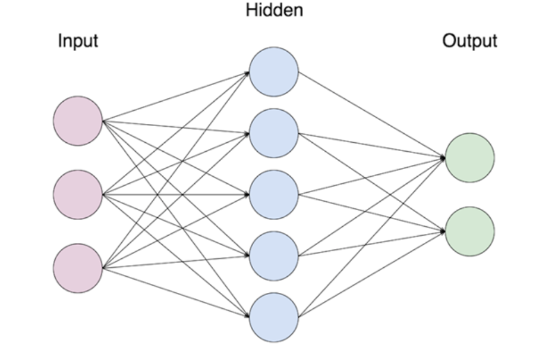

# Einführung
Moin, ich habe mich entschieden die Aufgabe als GitHub Repo um zusetzten.
Meine Arbeitsleistung besteht aus zwei Teilen:
1. Aus dieser Markdown datei, die als Einleitung in Künstliche Intelligenz gilt.
   

2. Aus dem Code und der Dokumentation des Repositories. 
   Der Code ist ein golang Projekt, in welchem ein funktionierendes Neurales Netzwerk programmiert wurde.  
   In [Doku.md](Doku.md) habe ich die funktionen und arbeitsweise des Codes grundlegend erklärt. 
   Jedoch mus ein gewisses Verständnis von dem Aufbau von Neuralen Netzwerken vorhanden sein, 
   damit man die Doku versteht.  
   Alle Datein, die aud `_test.go` enden sin Unit-Testes. 
   Es gibt keine start Funktion in diesem Projekt, jedoch ist `TestLearnNet()` in [learn_test.go](learn_test.go) der Umfassendste test.
   In ihm wird ein Neurales Netzwerk auf vier Daten sets trainiert.  
   Das Projekt hat 100 % Test Coverage und ich habe probiert den Code so verständlich und kurz wie nur Möglich zu schreiben.
   
## Was ist ein neuronales Netz?
   

Ein neurales Netz besteht aus mehreren Layern. 
Einem input Layer, einem oder mehreren hidden Layern und einem output Layer.  

Die Idee ist, dass man in den input Layer alle bekannten Daten reingibt 
und dann das Netzwerk einen errechneten Wert für jedes mögliche Ergebnis im output Layer produziert.
Man kann nun ein Netzwerk anlernen, so das z. B. die input Daten von einem Bild eines Sternes immer zu hohen Wert bei der
output Node werden, die für den Stern stehen.  

Man lernt ein neurales Netzwerk an in dem man es abwechselnd forward und backward paths mit verschiedenen daten sätzen rechnen lässt.
Siehe [Doku.md](Doku.md).